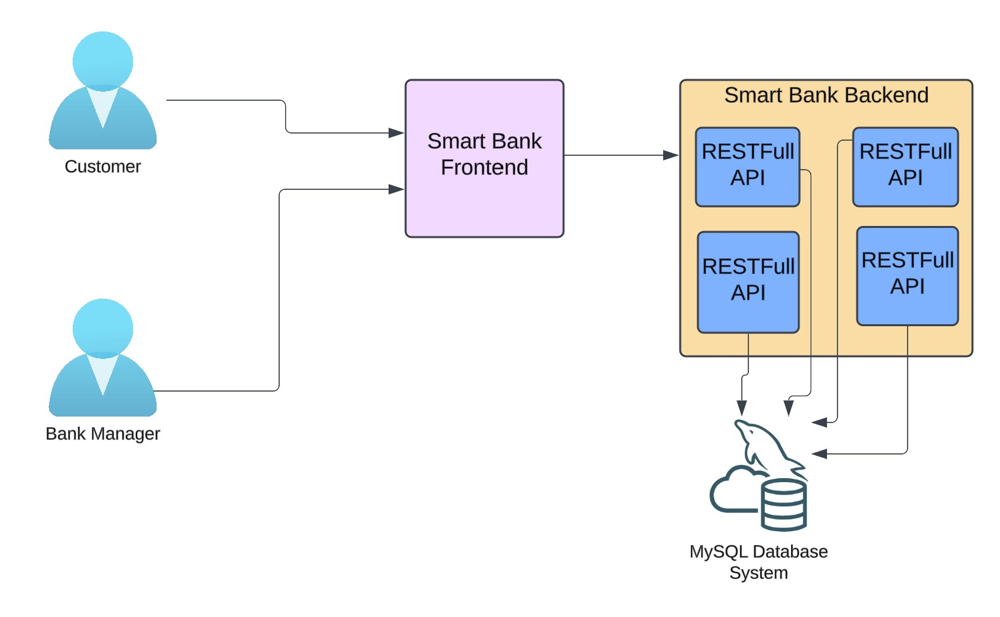
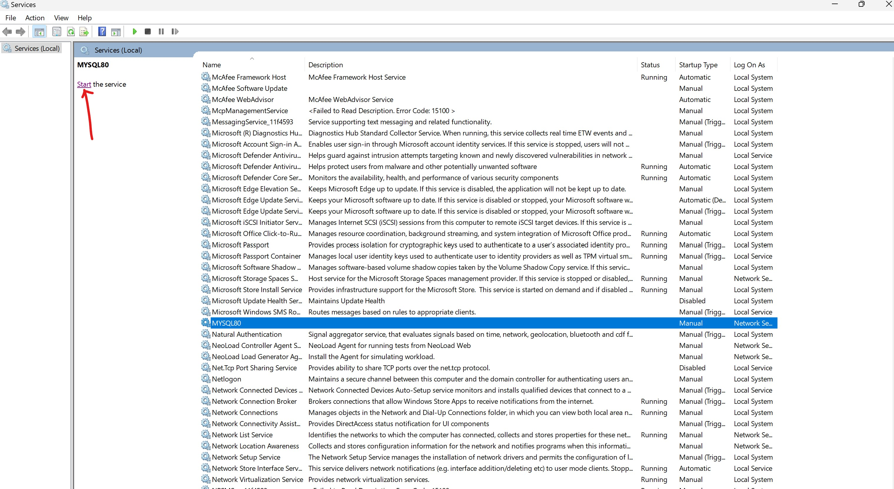
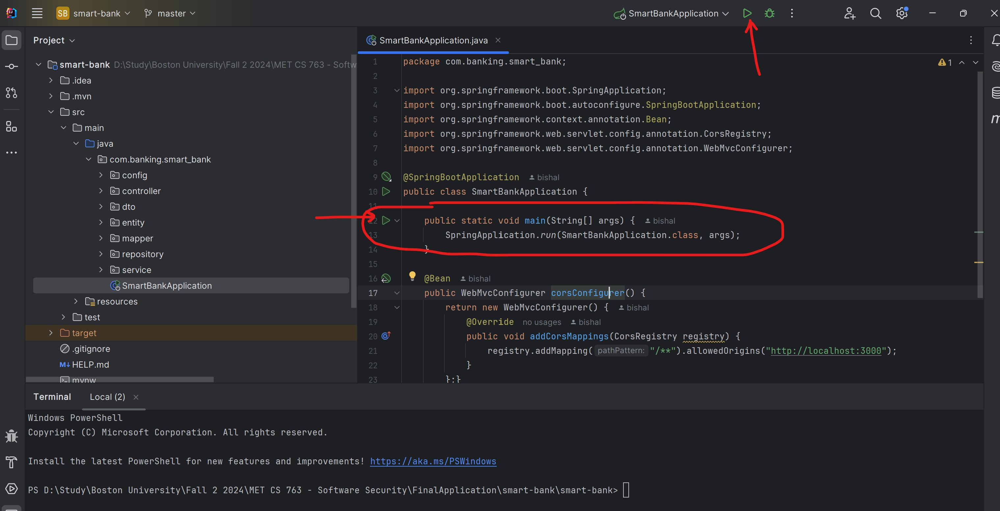
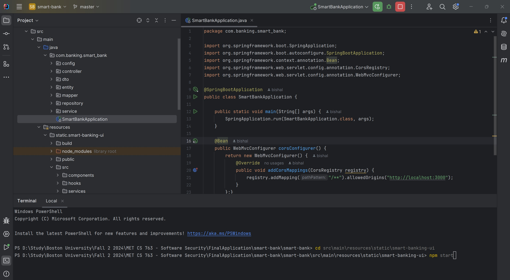
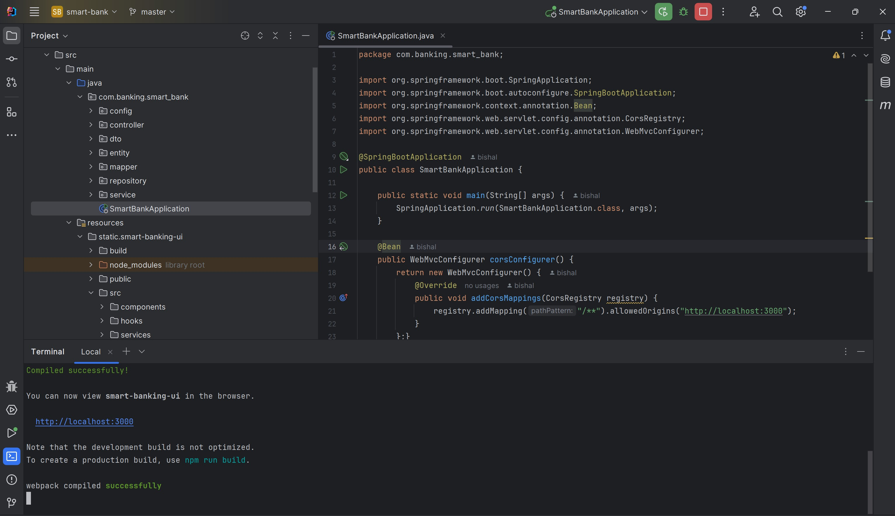

# Smart Bank

Smart Bank is a web-based banking application that allows bank account management features for Bank Employees and External Customers like internal and external transfers, account management, and transaction tracking. The application is built with a Spring Boot backend that hosts RESTfull APIs and a React frontend, providing a secure and responsive user experience.

## Table of Contents
1. [Features](#features)
2. [Tech Stack](#tech-stack)
3. [Architecture](#architecture)
4. [Installation](#installation)
5. [Running the Application](#running-the-application)
6. [SonarQube Code Quality Analysis](#sonarqube-code-quality-analysis)
7. [Contributing](#contributing)
8. [License](#license)

## Features

**Access Managment**
- **Role-Based Access**: Access control for different user roles (e.g., Bank Manager, User), limiting permissions based on role.
- **Real-Time Updates**: Real-time updates to balances and transaction records on the user interface.

**Internal Users**
- **Customer Management**: Add, Modify and Remove Customers.
- **Account Management**: View and manage all Customers bank accounts, including account balances.
  
**Externak Users**
- **Account Management**: View and manage bank accounts, including account balances and transaction history.
- **Internal and External Transfers**: Easily transfer funds between accounts within the bank or to external accounts with verification and logging.
- **Transaction History**: Track all past transactions with details such as date, amount, description, and type (credit/debit).

## Tech Stack

- **Backend**: Java, Spring Boot
- **Frontend**: React
- **Database**: MySQL
- **APIs**: RESTful APIs for handling account and transaction data
- **Code Quality**: Integrated with SonarQube for code analysis and quality checks

## Architecture

The application follows a **client-server architecture**:
- **Backend**: The backend provide RESTfull API services, implemented in Spring Boot that handles business logic, database access, and REST API endpoints.
- **Frontend**: The frontend React app provides a responsive user interface to allow internal and external users perform critical business processes.

 

## Installation

### Prerequisites
- **Java 11+**
- **Node.js & npm**
- **MySQL** (Create a database named `smartbank_db` and configure the connection in `application.properties`)

### Step-by-Step Setup

1. **Clone the Repository**
   ```bash
   git clone https://github.com/your-username/smart-bank.git
   cd smart-bank

2. **Run Frontent and Backend**
   Run the Frontend and Backend separately.

   a. First start the MySQL Database. In this case DB is running on the same machine.

   


   b. Next start the Backend by running the main function in SmartBankApplication class in SmartBankApplication.java file.
   
   

   c. If there are no errors the backend will start.

   


   d. Open a new Terminal. Change the directory to src\main\resources\static\smart-banking-ui. Perform rebuild using **"npm run build"**. Once the build is successfuly completed. Run "npm start".

   

   e. When the program runs fine.

    
